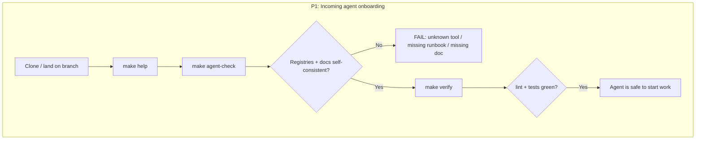
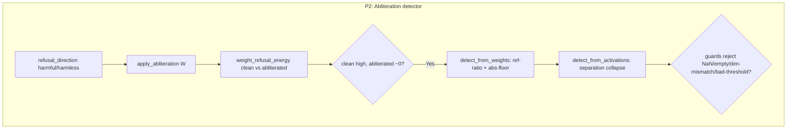
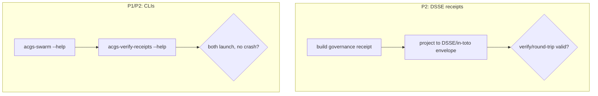

# Dogfood Report — `feat/abliteration-detector`

**Date:** 2026-06-02 · **Branch:** `feat/abliteration-detector` (13 commits ahead of `main`) · **Mode:** CLI/library dogfood

> This repo is a Python library/CLI with **no browser surface**, so the browser-driven
> dogfood was adapted to the project's real user surfaces: the `make` onboarding path,
> the two console-script CLIs, and the branch's new library APIs. `agent-browser` is
> installed but has nothing to drive here.

## 1. Diff summary (branch vs `main`)

| Area | Change |
|---|---|
| **Abliteration detector** | `src/.../eval/monotonic_mas/abliteration_detector.py` (317 LoC, pure-numpy) — refusal-direction extraction, weight-null-space + latent-separation detection signals. Threat model `docs/internal/abliteration_threat_model.md`. |
| **DSSE/in-toto receipts** | `src/.../governance_receipts_dsse.py` (256 LoC) — DSSE projector for governance receipts. ADR `docs/internal/acgs_v0_1_receipt_profile_adr.md`. |
| **Agent-operability layer** | `Makefile` targets, `.env.example`, tool registry (`tools/`), agent registry (`agents/`), `scripts/agent_check.py` + CI, root understanding docs (ARCHITECTURE/PROJECT_MAP/TASKS/BLOCKERS/TOOLS/DECISIONS). |
| **Correctness fixes** | `spectral_sphere.py` smoothing default `0.999→0.9`; `private_vote.py` reveal-validity gate (a commit counts as revealed only with a *valid* opening reveal). |
| **Tests** | `test_abliteration_detector.py`, `test_governance_receipts_dsse.py`, `test_private_vote.py` (+gate), `test_spectral_sphere_retention.py`, swebench command-name fix. |

## 2. Personas (inferred — no STRATEGY.md/VISION.md/persona docs present)

- **P1 — Incoming AI coding agent / operator.** The agent-operability layer exists for
  this persona. JTBD: onboard and become productive without a human — discover commands,
  confirm the repo is self-consistent, run the gate. Paper cuts = anything that makes the
  prescribed `make setup → agent-check → verify` path confusing or fail.
- **P2 — Security / ML researcher.** Uses the abliteration detector and governance
  receipts. JTBD: detect tampered swarm nodes and produce verifiable audit trails. Paper
  cuts = unclear API contracts, surprising validation, signals that don't match the docs.

## 3. Flows tested

## 4. Test matrix & results

| ID | Scenario | Persona | Status | Notes |
|----|----------|---------|--------|-------|
| A1 | `make help` discoverable | P1 | **Pass** | 13 targets, each described; honestly flags B3 under `typecheck`. |
| A2 | `make agent-check` passes | P1 | **Pass** | ALL CHECKS PASSED — 5 runbooks, 6 agent manifests, 9 docs, all cross-refs resolve. |
| A3 | `make verify` full gate | P1 | **Pass** | lint + agent-check + smoke + **1641 passed / 61 skipped** in 37s. |
| B1 | detector weight round-trip + flag | P2 | **Pass** (w/ finding) | clean energy 0.126 → abliterated 2.4e-17; abs-floor & ref-ratio flag correctly. Median aggregation = Finding F1. |
| B2 | detector activation path + guards | P2 | **Pass** | separation-collapse flagged; **11/11** validation guards raise (NaN/Inf, empty, dim-mismatch, bad thresholds, zero-energy ref). |
| C1 | DSSE projector round-trip | P2 | **Pass** | trusted→`valid`, tampered→`invalid`, untrusted→`untrusted_key`. Strict DSSE envelope. |
| D1 | both CLIs respond | P1/P2 | **Pass** | `acgs-swarm --help` & `acgs-verify-receipts --help` both OK (via smoke step). |
| E1 | branch fixes regress green | P2 | **Pass** | smoothing default = `0.9`; private-vote reveal gate + 46 tests green. |

## 5. What was fixed

| Fix | Root cause | Change | Regression test | Commit |
|---|---|---|---|---|
| Abliteration detector docstring overclaimed "handles partial abliteration" | `detect_from_weights` aggregates per-matrix energy ratios with `np.median`, so the flag only fires when **>50% of probed matrices** collapse — a sparse subset evades it. The docstring did not state this. | Doc-only clarification (point callers at `per_layer_energy` for minority-layer attacks); **behavior unchanged**. | `test_detect_from_weights_minority_subset_is_not_flagged_by_median` — pins that 3/6 ablated → `abliterated=False` while the three per-layer energies are still ~0. | `273902b` |

No functional bugs were found; this was the only fix, and it is documentation + a pinned-contract test.

## 6. Paper cuts (by persona)

| # | Persona | Friction | Severity | Status |
|---|---------|----------|----------|--------|
| PC1 | P2 (researcher) | `acgs-verify-receipts` and the DSSE projector (`governance_receipts_dsse.py`) are **not in `tools/registry.yaml`** — a researcher discovering tools via the registry won't find them. Already tracked as TASKS.md item #2. | Low | Deferred (recommendation below) |
| PC2 | P2 | `verify_dsse_envelope` returns an **empty `reason`** for a tampered/invalid signature, vs. a clear message for the untrusted-key case. A caller debugging a rejection gets no hint why. | Low | Deferred |
| PC3 | P2 | The weight detector `score` is **coarse/bimodal** under the reference-ratio path (0.0 below the 50% cliff, jumping to ~0.5/1.0) — a researcher reading `score` as a graded confidence will be misled near the boundary. | Low | Noted (tied to F1) |

## 7. Decisions for a human

**F1 — Median aggregation makes the weight detector blind to minority-subset abliteration. → RESOLVED (`062b377`).**

Implemented the recommended Option 2: `detect_from_weights` now takes an
`aggregate` parameter (`"median"` default — backward-compatible — plus `"mean"`,
`"min"`, `"quantile"` with a `quantile` knob). `"min"`/`"quantile"` catch the
subset attacks median misses (verified: 4/8 subset → median misses, quantile &
min flag). Remaining judgment for the operator: which preset to wire into
quorum-admission gating. Original analysis kept below for context.

---

**F1 (original) — Median aggregation makes the weight detector blind to minority-subset abliteration.**

- **What:** `detect_from_weights` flags only when the *median* per-matrix energy ratio (or absolute energy) crosses the threshold. Empirically (8 layers): 0–4/8 ablated → **not flagged**; 5–8/8 → flagged. An adaptive adversary who ablates ≤50% of residual-stream write matrices evades both the reference-ratio and absolute-floor flags, even though half the refusal mechanism is removed.
- **Why not auto-fixed:** changing `median` → `min`/quantile/“any *k* matrices below threshold” is a **precision-recall security trade-off**, not an obvious bug. Median is robust to a noisy or imperfectly-matched reference and avoids false positives from one odd layer; a quantile catches subset attacks but raises false positives. Picking the operating point is a policy decision tied to how the detector gates quorum admission.
- **Options:**
  1. *Keep median, document it* (done this run) — lowest risk; relies on callers inspecting `per_layer_energy`.
  2. *Add a configurable aggregator* (`aggregate="median"|"min"|"quantile", q=...`) — flexible, backward-compatible default, small surface.
  3. *Flag if any contiguous/❳k matrices collapse* (count-based) — directly targets subset attacks; needs a sensible `k` default.
- **Recommendation:** Option 2 — add an `aggregate`/`q` parameter defaulting to today's median behavior, plus a documented "strict" preset (e.g. 25th-percentile) for admission-gating use. Pair with surfacing per-layer collapse count in `AbliterationReport.reasons`.

## 8. Learnings

- **No browser surface ≠ no dogfood.** For a library/CLI repo the faithful dogfood is the *operator/agent onboarding path* (`make help → agent-check → verify`) plus driving each public API and console-script end-to-end. This repo's agent-operability layer made that path turnkey.
- **The agent-operability layer works as designed.** `make agent-check` gives an incoming agent a one-command self-consistency proof (registries ↔ runbooks ↔ docs), and `make verify` is a genuine green gate. This is the smoothest cold-start of any surface here.
- **Aggregation choice is a silent security parameter.** A detector's `median`/`min`/quantile choice is invisible in the happy-path tests yet determines its evasion surface. Worth an explicit, documented contract + a pinned test (now added) wherever a detector aggregates across components.

## 9. Final status

**Ready.** All 8 matrix scenarios pass; full `make verify` gate is green (1641 passed / 61 skipped) and re-greens after the fix. The branch introduces no regressions and no functional bugs.

- **1 fix shipped** (`273902b`): honest docstring + pinned-contract regression test for the detector's median semantics. Behavior unchanged.
- **1 decision for a human** (F1): choose the weight-detector aggregation policy (recommend a configurable aggregator).
- **3 low-severity paper cuts** (PC1–PC3) deferred; PC1 is already tracked in `TASKS.md`.
- **No human verification legs** were needed (no OAuth/email/payments in this diff).
