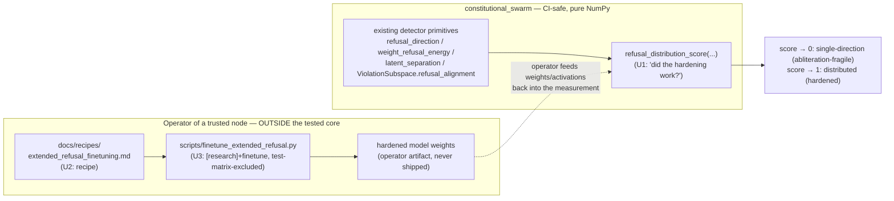

# feat: extended-refusal fine-tuning — Option A (recipe + CI-safe measurement)

## Summary

Closes the last open follow-up in the abliteration threat model
(`docs/internal/abliteration_threat_model.md`, *Follow-ups → Open #2*) along the
**Option A** path the feasibility study recommended: the library does **not**
absorb a training pipeline. Instead it ships (1) a CI-safe, pure-NumPy
**`refusal_distribution_score`** that answers *"is this model's refusal
single-direction (abliteration-fragile) or distributed (hardened)?"* — the
verifiable deliverable; (2) a `[research]`-gated, test-matrix-excluded **reference
recipe + driver** for the actual extended-refusal fine-tuning (arXiv:2505.19056),
where the GPU/dataset/weights burden belongs to the operator of a trusted node;
and (3) honest **documentation closure** that reframes threat-model #2 as
*shipped-with-scope* (measurement + recipe ship; weight-hardening stays an
operator action), not blanket-closed.

The defining constraint: **preserve the package's CI-safe, externalized-enforcement
identity**. No new always-on dependency, no training loop in the tested core, no
claim that "the library hardens models." The library *measures* the outcome; the
operator *produces* it.

---

## Problem Frame

Abliteration removes refusal by orthogonalizing residual-stream write matrices
against a *single* refusal direction `r̂`. Extended-refusal fine-tuning distributes
the refusal behavior across *many* dimensions so no single-direction edit can
remove it (>90% residual refusal reported, arXiv:2505.19056). It is a
*training-time* defense for **trusted nodes**, complementing the already-shipped
*externalized* defenses (detector, two admission gates, hardened steering).

The shipped abliteration work is deliberately model-free and CI-safe
(`abliteration_detector.py`: "no torch/live model needed"). A fine-tuning loop
breaks that on four axes (compute, CI, artifact = model weights, determinism), as
the feasibility study tabulates. This plan therefore **splits the work along the
CI-safe boundary**: the part the library can verify deterministically (measuring
how *distributed* a model's refusal is) lands in the tested core; the part it
cannot (the training run) ships as an excluded reference artifact.

**Carried-forward decisions from the feasibility study (origin):**
- Identity → recipe + eval, not in-package training (Option A, *see origin: Recommendation*).
- Dependency surface → no new always-on deps; heavy deps stay opt-in and out of the test matrix (*see origin: Key Question 2, Scope Boundaries*).
- Verifiability → a measurement-only contribution is sufficient to close the gap (*see origin: Key Question 3*).
- Dataset/licensing → document dataset *shape*; ship no corpus (*see origin: Key Question 4, Scope Boundaries*).

---

## High-Level Technical Design

The Option A boundary — what lives inside the CI-tested library versus what the
trusted-node operator runs externally — is the load-bearing design decision, so
the flow makes it explicit:

The dashed edge is the only coupling: the operator runs training externally, then
hands weights/activations to the library's deterministic measurement. The library
never trains, never holds a dataset, never ships weights.

*Directional guidance for review — not implementation specification.*

---

## Key Technical Decisions

### KTD1 — `refusal_distribution_score` lives in `abliteration_detector.py`

It reuses that module's existing primitives (`refusal_direction`,
`weight_refusal_energy`, `latent_separation`) and shares its "measurement/admission,
does not modify any model" contract. Co-locating keeps the detector core cohesive
and the new function discoverable next to `detect_from_weights` /
`detect_from_activations`. Add it to `__all__`. *Alternative rejected:* a new module
would fragment the detector surface for no isolation benefit.

### KTD2 — Distribution is measured as concentration of refusal energy (weight-mode primary)

The signal that distinguishes single-direction from distributed refusal is **how
concentrated the refusal-relevant energy is across orthogonal directions**, not the
scalar mean-difference distance (which is rank-1 by construction and so cannot
reveal distribution). Weight-mode is mechanistically exact and trivially
fixture-able: a single-direction model concentrates refusal energy on rank-1 (score
→ 0, fragile); a distributed model spreads it across a rank-`m` basis (score → 1 as
`m` grows). The exact normalization (participation ratio
`(Σσ²)²/Σσ⁴`, normalized effective rank, or singular-value entropy) is an
**implementation-time choice** (see Deferred) — the *contract* below is fixed.

**Contract (fixed):** input is residual-stream write matrices (weight-mode) and/or
harmful/harmless activation sets (activation-mode companion); output is a float in
`[0, 1]`, **higher = more distributed = more abliteration-hardened**; deterministic;
pure NumPy; raises on degenerate/empty/dim-mismatch input, matching the existing
detector's validation style.

### KTD3 — FT driver dependencies: opt-in `finetune` extra (recommended) vs document-only

The driver needs a trainer (`trl` and/or `peft`) on top of the `[research]` extra's
torch/transformers. Two options preserve "no new always-on dependency":

- **Recommended — add an opt-in `finetune` extra** (`trl`, `peft`) composing with
  `research`. Pinnable (a reproducible recipe needs pinned trainer versions),
  discoverable, and never installed by default. Dependabot already groups
  python-minor-patch bumps, so the maintenance delta is bounded.
- *Alternative — document-only*: the recipe instructs `pip install trl peft`, and
  `pyproject.toml` is untouched. Lowest surface, but unpinned and undiscoverable.

This plan proceeds with the **`finetune` extra**; flagged here because it is the one
place Option A widens `pyproject.toml`, per origin Key Question 2. The extra is opt-in
and out of the test matrix, so it does not touch the always-on install or CI-safety.

### KTD4 — The training path carries no CI coverage, by design

The driver lives in `scripts/` (never collected by the test suite, like the
SWE-bench live-eval scripts) and any optional smoke test is marked `research` (the
dev matrix runs `-m "not slow and not benchmark and not e2e and not research and not
bittensor"`). This is the explicit, documented consequence of Option A — not an
oversight. Only `refusal_distribution_score` (U1) is gated by CI.

### KTD5 — Threat-model #2 becomes *Shipped (Option A)*, scoped — not blanket-closed

Shipping measurement + recipe does **not** harden any specific deployed model; that
remains an operator action. U4 moves #2 from Open to Shipped with an explicit scope
note ("the library documents the recipe and *measures* the result; producing hardened
weights is the trusted-node operator's responsibility"), keeping the threat model
honest about what was and was not delivered.

---

## Scope Boundaries

### In scope
- A CI-safe, pure-NumPy `refusal_distribution_score` + full test coverage (U1).
- A `[research]`/`finetune`-gated reference recipe (U2) and thin driver (U3),
  excluded from the test matrix.
- Documentation closure: threat model, feasibility-doc status, CHANGELOG (U4).

### Non-goals (from origin)
- **No training loop, dataset, or model weights in the CI-tested package core.**
- **No always-on dependency**; trainer deps stay in the opt-in `finetune` extra.
- **No claim that the package "hardens models"** — it documents a recipe and
  measures the outcome.

### Deferred to Follow-Up Work
- **Paper wording.** `paper/constitutional_swarm_paper.md` currently contains **no
  abliteration / threat-model section** (it is focused on mHC, Birkhoff, Byzantine
  tolerance). Adding a defense-in-depth subsection is a net-new paper section out of
  scope for this implementation plan; the threat-model doc + CHANGELOG carry the
  wording for now. Revisit when the paper gains a robustness/threat section.
- **Activation-mode admission gate** wiring `refusal_distribution_score` into
  `node_admission` (analogous to the existing abliteration gates) — measurement
  ships first; admission integration is a separate, additive follow-up.

---

## Implementation Units

### U1. CI-safe `refusal_distribution_score`

**Goal:** Ship the verifiable deliverable — a deterministic, pure-NumPy measurement
of how distributed a model's refusal is, so callers can tell an abliteration-fragile
(single-direction) model from a hardened (distributed) one. This is the part Option A
puts inside the CI-tested core.

**Requirements:** Closes the measurement half of threat-model Open #2; satisfies
origin Key Question 3 (verifiability) and Recommendation deliverable #1.

**Dependencies:** none.

**Files:**
- `src/constitutional_swarm/eval/monotonic_mas/abliteration_detector.py` (modify — add the function + add to `__all__`; optional small `DistributionReport` dataclass if a scalar is insufficient)
- `tests/` — extend the existing abliteration-detector test module (locate the file importing `abliteration_detector` / `detect_from_weights`; add the new test class there rather than a new file)

**Approach:** Reuse `refusal_direction`, `weight_refusal_energy`, and
`latent_separation`. Per KTD2, the primary signal is **concentration of refusal
energy across orthogonal directions** (weight-mode), with an optional activation-mode
companion. Mirror the existing detector's input validation (2-D shape checks,
`_require_finite`, raise on empty/zero/dim-mismatch) and its `[0, 1]` scoring
convention. Keep the public signature small and keyword-only for optional knobs,
matching `detect_from_weights`.

**Technical design (directional, not specification):**
- Weight-mode: assemble the refusal-relevant energy spectrum across an orthonormal
  candidate-direction basis; reduce its singular/energy values to a concentration
  scalar. Single-direction → energy on one axis → score ≈ 0; rank-`m` distributed →
  score increases monotonically in `m`.
- Activation-mode companion: fit a higher-rank `ViolationSubspace`
  (`fit_subspace(rank=k)`) and report how the refusal-discriminability spreads across
  components (e.g., via `refusal_alignment` spread). Optional; weight-mode is the
  primary deliverable.
- Exact normalization (participation ratio vs effective rank vs s.v. entropy) is an
  implementation-time choice — pick one, document the intuition in the docstring.

**Patterns to follow:** `detect_from_weights` / `detect_from_activations` in the same
file (validation, keyword-only knobs, `[0,1]` scoring, `reasons` strings);
`ViolationSubspace.refusal_alignment` for the captured-energy idiom
(`(unit @ basis.T) ** 2`).

**Test scenarios:**
- **Happy path — single-direction fixture.** Build write matrices whose refusal
  energy lies along one `r̂` (use `apply_abliteration` to construct clean-vs-collapsed
  references); assert score ≈ 0 (fragile). *Covers the core fragility claim.*
- **Happy path — distributed fixture.** Spread refusal energy across a rank-`m`
  orthonormal basis; assert score is high and **increases monotonically** as `m` grows
  from 1 → several.
- **Cross-check with the detector.** On a distributed fixture, abliterating *one*
  direction leaves `detect_from_weights` (min-aggregate) still flagging residual
  energy elsewhere, and `refusal_distribution_score` stays high — the two signals
  agree on "distributed."
- **Inverse-correlation property.** Score correlates inversely with single-direction
  abliteration efficacy (lower score → one edit removes more refusal energy).
- **Determinism.** Same input → identical output across repeated calls.
- **Edge/error paths.** Empty input, zero matrix/zero activations, NaN/Inf, and
  dim-mismatch each raise `ValueError` with a message matching the module's style.
- **Activation-mode companion (if implemented).** Single-cluster vs multi-cluster
  harmful activations produce low vs high scores respectively.

**Verification:** `make verify` is green (lint + typecheck + tests); the new function
is exported in `__all__`; the single-direction vs distributed fixtures produce the
expected score ordering; no new mypy errors (the whole package is enforced — no
allow-list).

---

### U2. Reference recipe: `docs/recipes/extended_refusal_finetuning.md`

**Goal:** A runnable, operator-facing recipe for extended-refusal fine-tuning that an
external trusted-node operator can follow, framed explicitly as "reference, not a
CI-tested package feature."

**Requirements:** Origin Recommendation deliverable #2; satisfies Key Question 4
(dataset shape documented, no corpus shipped).

**Dependencies:** U1 (the recipe's "did the hardening work?" check calls
`refusal_distribution_score`).

**Files:**
- `docs/recipes/extended_refusal_finetuning.md` (create — new `docs/recipes/` directory)

**Approach:** Document model choice, **dataset shape** (refusal/harmful-prompt corpus
structure — not the data itself, per the licensing non-goal), the multi-direction
refusal objective (arXiv:2505.19056), hyperparameters, the expected residual-refusal
target (>90%), and the **verification step**: run `refusal_distribution_score` on the
resulting weights/activations to confirm refusal is now distributed. State the install
path (`pip install 'constitutional-swarm[research,finetune]'`) and mark the whole
recipe as out-of-CI reference material. Cross-link the threat model and the feasibility
doc.

**Patterns to follow:** existing operator-facing docs under `docs/` (e.g.,
`docs/quickstart.md`, `docs/security-model.md`) for tone and structure; the feasibility
doc's Option A section for framing.

**Test scenarios:** `Test expectation: none — documentation only (no behavioral code).`
The only automatable check is link/path validity, covered by the repo's existing doc
checks if any; otherwise verified by review.

**Verification:** The recipe references real symbols (`refusal_distribution_score`
exists after U1), real install extras (after U3's `finetune` extra), and the
threat-model/feasibility paths resolve; a reader could execute it end-to-end in their
own torch+trl environment.

---

### U3. `[research]`+`finetune`-gated FT driver + `finetune` extra

**Goal:** A thin, runnable reference driver implementing the recipe, kept entirely out
of the test matrix, plus the opt-in `finetune` extra that pins its trainer
dependencies.

**Requirements:** Origin Recommendation deliverable #2 (the "optional `scripts/`
driver"); enacts KTD3 + KTD4.

**Dependencies:** U2 (driver implements the documented recipe).

**Files:**
- `scripts/finetune_extended_refusal.py` (create — runnable driver; heavy imports inside `main()` / guarded, following existing script conventions)
- `pyproject.toml` (modify — add `finetune = ["trl>=...", "peft>=..."]` optional extra; pin versions; document it composes with `research`)

**Approach:** Mirror the structure of existing live-eval scripts (e.g.,
`scripts/run_swe_bench_lite.py`, `scripts/testnet_deploy.py`): a CLI driver with an
`argparse` front end and a `main()` entry point. It wires torch/transformers/trl to run
the extended-refusal objective from the recipe and, on completion, calls
`refusal_distribution_score` to report whether refusal is now distributed. Never
imported by the test suite; never linted in the gate (`ruff check` is `src/`-only) but
must pass `ruff format scripts/`.

**Patterns to follow:** `scripts/run_swe_bench_lite.py` / `scripts/testnet_deploy.py`
(CLI + `main()` shape, heavy-dep handling); `[project.optional-dependencies]` blocks in
`pyproject.toml` (e.g., `research`, `vertex`) for the extra's comment + composition idiom.

**Test scenarios:** `Test expectation: none — torch/trl driver, excluded from the test
matrix by design (KTD4).` If a smoke test is added, it must be marked `research` so the
dev matrix skips it. Do **not** add an always-on test that imports the driver.

**Verification:** `ruff format scripts/` is clean; `make verify` stays green (the driver
is not collected, so torch/trl absence does not break CI); `pip install
'.[research,finetune]'` resolves; the driver's `--help` runs in an environment with the
extras installed.

---

### U4. Documentation closure (threat model · feasibility status · CHANGELOG)

**Goal:** Honestly close threat-model Open #2 as *Shipped (Option A), scoped*, flip the
feasibility doc to reflect that it has been actioned, and record the change in the
CHANGELOG.

**Requirements:** Origin Recommendation deliverable #3 (threat-model wording);
completes the follow-up tracking.

**Dependencies:** U1, U2, U3 (the closure text references all three).

**Files:**
- `docs/internal/abliteration_threat_model.md` (modify — move #2 from *Open* to *Shipped* with a scope note; the "Open" list becomes empty or gains a forward-pointer to the deferred admission-gate follow-up)
- `docs/plans/2026-06-03-001-feat-extended-refusal-finetuning-feasibility.md` (modify — frontmatter `status: proposed → accepted`; add a one-line "actioned by `docs/plans/2026-06-03-002-...`" note)
- `CHANGELOG.md` (modify — under `[Unreleased] → Added`: the `refusal_distribution_score` measurement, the recipe, and the `finetune` extra)

**Approach:** Frame #2 as *shipped-with-scope* per KTD5: the library ships the
CI-safe measurement and the operator recipe; producing hardened weights remains a
trusted-node operator action, explicitly outside the externalized-enforcement core.
Do **not** overclaim a model was hardened. Keep the threat model's existing
Shipped-bullet style (✅ + concise rationale + arXiv refs).

**Patterns to follow:** the existing Shipped bullets in
`abliteration_threat_model.md` (✅ prefix, one-paragraph rationale, "Pure-NumPy,
CI-safe" tags); recent CHANGELOG `[Unreleased]` entries for phrasing.

**Test scenarios:** `Test expectation: none — documentation only.`

**Verification:** Threat model's *Open* section no longer lists #2 as unaddressed; the
feasibility doc reads `status: accepted`; CHANGELOG entries are present and accurate;
all three docs cross-reference consistently and name only symbols/extras that now exist.

---

## Sources & Research

- `docs/plans/2026-06-03-001-feat-extended-refusal-finetuning-feasibility.md` (origin — Option A scope, the four Key Questions, the recommendation)
- `docs/internal/abliteration_threat_model.md` (Follow-ups → Open #2; the Shipped-bullet style to mirror)
- `src/constitutional_swarm/eval/monotonic_mas/abliteration_detector.py` (`refusal_direction`, `weight_refusal_energy`, `latent_separation`, `apply_abliteration` — U1's building blocks and fixture tools)
- `src/constitutional_swarm/violation_subspace.py` (`refusal_alignment`, `fit_subspace` — the captured-energy idiom and activation-mode companion)
- `pyproject.toml` `[project.optional-dependencies]` (the extra idiom for `finetune`); CI dev matrix marker `-m "not ... not research ..."` (the test-matrix exclusion mechanism)
- arXiv:2505.19056 (extended-refusal defense + latent-separation signal), arXiv:2406.11717 (Arditi — refusal direction), arXiv:2602.02132 (multi-directional refusal)

## Deferred to Implementation

- **Exact `refusal_distribution_score` normalization** — participation ratio
  `(Σσ²)²/Σσ⁴` vs normalized effective rank vs singular-value entropy. The contract
  (KTD2) is fixed; the estimator is chosen during U1 against the synthetic fixtures.
- **Whether a `DistributionReport` dataclass is warranted** or a bare float suffices —
  decide once the U1 score's auxiliary outputs (per-direction energy, chosen `r̂`) are
  concrete.
- **`trl`/`peft` version pins** for the `finetune` extra — set during U3 against the
  current PyPI releases; pin conservatively (lower bound matching the recipe's API use).
