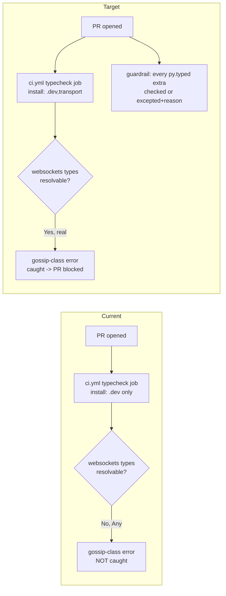

# fix: Make the typecheck gate environment-consistent across optional extras

## Summary

The `make verify` / CI type gate runs `mypy` in exactly one place — the `ci.yml`
`typecheck` job — and that job installs `.[dev]` **only**. Every *other* CI job
installs the `transport` extra, and the local `make typecheck` default
(`EXTRAS="dev transport"`) does too. The result: a type error that only manifests
once an optional dependency's real (`py.typed`) types resolve is **invisible to
the gate** until that extra is installed — so it never blocks a PR. This was
proven by `gossip_protocol.py` (`connection_closed_error` narrowed to
`type[RuntimeError]` vs `type[ConnectionClosed]`), which a local `make verify`
would catch but CI would not.

This plan makes the type gate's coverage **environment-consistent**: align the CI
typecheck env with the local one (install the type-bearing `transport` extra),
add a guardrail that fails CI when a declared optional extra escapes the type
surface without an explicit, reasoned exception, and reconcile the governance docs
that still encode the superseded "dev-only / no-extras / ruff-only" framing. It is
**not** a mypy-strictness sweep and does **not** pull the heavy `research` (torch)
surface into the gate.

---

## Problem Frame

`mypy` only "sees" the real types of a dependency that ships `py.typed`. Among the
declared extras, `transport` (`websockets`) is the one currently-installed extra
that **both** ships `py.typed` **and** has its symbols used in a type-narrowing
position. So the install surface of the typecheck job — not the mypy config —
decides what the gate can catch. Today that surface disagrees between CI and local:

| Gate run | Extras installed at mypy time | `websockets` real types seen? | Catches the gossip-class error? |
|---|---|---|---|
| `ci.yml` → `typecheck` job | `dev` only | No (`Any` via `ignore_missing_imports`) | **No** |
| Local `make typecheck` (default `EXTRAS="dev transport"`) | `dev` + `transport` | Yes | Yes |
| Every other CI job (`test`, `security`, `agent-check`, `test-extras-transport`) | includes `transport` | Yes (but these jobs don't run mypy) | n/a |

The one job that type-checks is the one job that never installs the extra whose
`py.typed` would expose the divergence. The mypy config itself is sound and
intentional (`pyproject.toml [tool.mypy]`): `ignore_missing_imports = true`,
`warn_unused_ignores` deliberately **off** (env-divergent `# type: ignore`s would
flip-flop), `follow_imports = "skip"` pinned for `acgs_lite.*` to neutralize a
prior workspace-vs-PyPI drift (the bug that once bit `dna.py`). The gap is purely
in *which dependency surface the gate is run against*, plus a comment that
actively argues the wrong rationale.

Two consequences compound the risk: (1) the gate's "clean" claim is
env-relative — `BLOCKERS.md` B3 records "108 files clean **without heavy extras
installed**", while the default *local* frame already includes `transport`; and
(2) `langgraph`/`langchain` ship `py.typed` and are a **second env-sensitive
surface that is already broken, not merely latent**. Installing the pinned stack
and running the repo's mypy config reproduces a **live** error today —
`langgraph_runtime/swarm_topology.py:126` (`Incompatible return value type` /
generic-variance on the `before_agent`-decorated `_guard` return) — and, under the
floor of the `mypy>=1.11` pin (mypy 1.11.0), installing langgraph **crashes mypy
with an INTERNAL ERROR**. This surface is hidden only because langgraph is
uninstalled in every env. It is deliberately kept **out of the aligned `transport`
surface this plan ships** (so HEAD stays green) and routed to follow-up as a real
*code* fix plus a mypy-version-pinning decision — see Deferred Follow-Up. The gate
is also **mypy-version-sensitive**: CI pins `mypy>=1.11` unbounded, and the
langgraph result differs between 1.11 (crash) and 2.x (the variance error) — a
reproducibility consideration carried into Risks.

**Current baseline (verified 2026-06-03 at HEAD `c321178`):** `make typecheck`
passes (110 source files, 0 errors) *with* `transport` installed. So the aligned
surface currently exposes **zero** new errors — the proven instance
(`gossip_protocol.py:262`) is already fixed and committed. This plan therefore
closes a **structural** gap (CI never catches the *next* such error) rather than
fixing a currently-red gate. *Stated assumption:* this is a governance bet that
transport-class errors recur often enough to police — the historical instantiation
count is **one**, and it was caught locally by `make verify` before CI. The bet is
justified by near-zero cost (light installs, an offline guardrail), not by a
demonstrated recurrence rate; U1 (the one-job structural fix) stands on its own
regardless.

---

## Requirements

- **R1.** CI's `mypy` gate must type-check the same dependency surface as the local
  `make typecheck` default — i.e. with the type-bearing `transport` extra
  installed — so a type error that only manifests under an optional dep's real
  types cannot pass CI.
- **R2.** The `ci.yml` typecheck-job comment that claims optional extras "are not
  needed and would only add env variance" must be corrected: installing
  `py.typed` extras is the point — that variance is where real errors live.
- **R3.** A regression guardrail must fail CI when a declared optional extra is not
  classified as either **type-checked** (installed by a typecheck env) or
  **excepted-with-reason**, so a newly added extra-gated module/extra cannot
  silently escape the type surface.
- **R4.** Two-part: (a) **contingency** — any type error the aligned `transport`
  surface exposes during U1 must be fixed using the repo's established
  `TYPE_CHECKING`-guard / explicit-annotation convention
  (`src/constitutional_swarm/AGENTS.md`); and (b) **verification** — U1 must
  positively confirm the aligned surface reports zero new errors (110 files clean)
  before the CI flip lands. The aligned surface currently exposes none, so (a) is
  expected to be a no-op and (b) is the binding assertion.
- **R5.** The stale governance surfaces that encode the superseded
  "no-extras / 108-files / ruff-only / acgs-lite-untyped" framing must be
  reconciled, and the canonical typecheck-surface decision recorded as a
  `DECISIONS.md` entry.
- **R6.** Preserve existing invariants: `warn_unused_ignores` stays **off**,
  `warn_redundant_casts` stays **on**, `manifold.py` untouched, no `git add -A`,
  no change to the constitutional hash `608508a9bd224290` or quorum constants. The
  invariant is mypy-config **substance** — non-functional **comment** edits to
  `pyproject.toml [tool.mypy]` (e.g. correcting a stale claim) are allowed and
  expected.

---

## Key Technical Decisions

- **KTD1 — Run mypy in TWO cheap blocking configs: keep the existing no-extras
  (`dev`) job AND add a `dev + transport` job. Do not build a full per-extra
  matrix.** This is the recommended design over a single-job *replace* because it is
  a guaranteed superset rather than an asserted one, and because this is a
  **published library (v1.0.0 on PyPI)** whose no-extras surface is a real
  distribution contract — keeping a no-extras typecheck job preserves the `BLOCKERS.md`
  B3 "clean without extras" baseline as a *live* gate, while the new transport job
  catches the env-sensitive errors the dev-only job structurally cannot. Both jobs
  are light (`websockets` is small; no heavy installs), so the cost is one extra
  fast job, not CI minutes that matter.
  *Why not a single `dev+transport` replace:* a round-1 feasibility pass empirically
  verified the with-transport run *dominates* the no-extras run for error detection
  (mypy statically checks both branches of every `try/except import`; a planted error
  in the `except ImportError:` branch is flagged identically with/without the extra),
  so a single transport job would also close R1 — but "replace" drops the only job
  that type-checks the pure no-extras consumer surface, and rests losslessness on that
  dominance claim. Two runs cost ~one extra fast job and remove the dependence on the
  claim; that is the better trade for a shipped library. (Single-transport-replace
  remains an acceptable lighter fallback if a second CI job is unwanted.)
  *Why not a full matrix:* a per-extra typecheck matrix (mirroring `test-extras-*`)
  isolates which extra regressed but multiplies CI minutes; warranted only if two
  extras ever pull conflicting transitive types (none do today). Deferred.
  (Grounded in external research: install-all vs matrix trade-offs; `py.typed` is the
  deciding factor.)

- **KTD2 — Exclude the heavy `research` (torch/transformers) surface from the gate;
  classify it as a documented exception.** torch is multi-GB and both torch and
  transformers have repeatedly crashed mypy; value-to-cost is low. If ever gated,
  install it but `follow_imports = "skip"` on `torch.*`/`transformers.*` so mypy
  does not recurse into crash-prone internals. A scoped, non-blocking research
  typecheck job is deferred follow-up.

- **KTD3 — The guardrail is an extras-classification assertion, mirroring
  `scripts/agent_check.py`, not a mypy plugin.** Every declared extra in
  `[project.optional-dependencies]` must be classified as `checked` (and then must
  be installed by a typecheck env) or `excepted` (and then must carry a reason).
  An unclassified or checked-but-uncovered extra exits non-zero. This is the
  ~30-line "declared-extras vs typecheck-env" reconciliation pattern (prior art:
  Synapse `check_dependencies.py`), wired into `make verify` and CI the same way
  `agent-check` is. Three rules pinned here so the implementer doesn't decide them
  mid-build: (a) **manifest location** = a `[tool.constitutional_swarm.typecheck_coverage]`
  table in `pyproject.toml` (co-located with the extras; no new file/schema); (b)
  **typecheck-env identification (3 sub-steps, pinned)** = (i) a "typecheck job" is a
  `ci.yml` job that contains a step whose `run` invokes `mypy` — match on the
  **mypy-step**, treated as authoritative, NOT on a GitHub `name:` field (no job in
  `ci.yml` has a `name:`; "the `typecheck` job" is the YAML **mapping key** under
  `jobs:`, usable as a secondary signal but not required); (ii) within each matched
  job, extract extras from *that same job's* `pip install -e ".[...]"` step (a
  different step than the `mypy` one) via `\.\[([^\]]+)\]`, comma-split and
  whitespace-strip; (iii) scan *only* matched jobs — never every `pip install` line —
  so the `test` job's interpolated `.[${{ matrix.extras }},transport]` (`ci.yml:25`)
  and the mypy-less `test-research`/`test-extras-transport` jobs are excluded.
  (c) **coverage rule** = a `checked` extra must be installed by *at least one
  blocking* typecheck job (a later non-blocking research job per KTD2 does not
  satisfy coverage and need not carry every checked extra). Note: this parser is
  coupled to `ci.yml`'s install-line phrasing — a future workflow restructure
  (reusable workflows, `uv pip install`, multi-line `run:`) can break extraction;
  U2's integration test (real repo → exit 0) makes such a break a loud false-fail,
  not a silent false-pass.

- **KTD4 — Keep `warn_unused_ignores` OFF (preserve the existing invariant).**
  Re-enabling it via the `# type: ignore[<code>,unused-ignore]` pattern is a
  legitimate, larger hardening but requires touching every env-divergent ignore
  across the package; it is **out of scope** for closing this blind spot and is
  routed to deferred follow-up. Adding `transport` to the gate does **not** break
  the existing `# type: ignore[import]`s on `import websockets` because the flag is
  off (an unused ignore is silently tolerated).

- **KTD5 — Fix convention for any surfaced error: `TYPE_CHECKING`-guard / explicit
  annotation** (`src/constitutional_swarm/AGENTS.md` worked example). Annotate
  against the real optional type under `if TYPE_CHECKING:` and gate the runtime
  import, so the reference is type-checked even with no extra installed. (Used only
  if/when the aligned surface surfaces an error.)
  *Framing (acknowledged trade-off):* env-**invariance** (this pattern — code that
  type-checks identically with or without the extra) is the mechanism that
  structurally *retires* the bug class; env-**alignment** (U1, install the extra in
  CI) is a faster stopgap that needs the U2 guardrail to *police* it. This plan ships
  alignment + policing now because the surface is green today (no concrete errors to
  lift) and alignment is a near-zero-cost win; the broader env-invariance migration
  (`# type: ignore[…,unused-ignore]`, per-module overrides) is the deferred direction
  that would eventually make the guardrail unnecessary. The two are complementary, not
  competing.

---

## High-Level Technical Design

The change has two moving parts a reviewer should see at a glance: the *env
alignment* (a state change in which surface the gate runs against) and the
*guardrail control flow* (the new decision gate). Diagrams are authoritative
alongside the prose.

**1. Env alignment — current vs target gate surfaces**



**2. Guardrail control flow** (directional guidance, not implementation spec):

```text
for each extra in pyproject [project.optional-dependencies]:
    classification = lookup(extra in coverage manifest)
    if classification is missing:        -> FAIL  "extra '<x>' is unclassified"
    if classification == "checked":
        if extra not installed by any typecheck CI env: -> FAIL "'<x>' checked but uncovered"
    if classification == "excepted":
        if no reason given:              -> FAIL  "'<x>' excepted without reason"
exit 0 if no failures else 1
```

The manifest classifies today's extras as: `transport` → checked; `research`,
`langgraph`/`langgraph-swarm`, `bittensor`, `gemini`, `vertex`, `semantic`,
`latent`, `finetune` → excepted with a per-extra reason (stub-less, heavy, or
deferred). Adding a new extra fails the guardrail until it is classified.

---

## Implementation Units

### U1. Add a `transport` typecheck job alongside the no-extras one

**Goal:** Make CI `mypy` run in two cheap blocking configs — keep the existing
no-extras (`dev`) job AND add a `dev + transport` job — so the gate catches the
env-sensitive type errors the dev-only job structurally cannot, without dropping the
published-library no-extras surface. Correct the misleading rationale comment.

**Requirements:** R1, R2, R4, R6.

**Dependencies:** none.

**Files:**
- `.github/workflows/ci.yml` — keep the existing `typecheck` job (`.[dev]`) and its
  comment (rewritten); add a sibling `typecheck-transport` job that installs
  `.[dev,transport]` and runs `mypy`. (A single-job `.[dev,transport]` *replace* is
  the documented lighter fallback per KTD1.)
- `Makefile` — confirm/annotate that `make typecheck` already runs the
  `dev + transport` surface by default (`EXTRAS ?= dev transport`); no behavioral
  change expected, only a clarifying comment if warranted.
- `pyproject.toml` — `[tool.mypy]` only if a clarifying comment about the canonical
  surface is added; **no** functional config change (keep `ignore_missing_imports`,
  `warn_unused_ignores` off, the `acgs_lite.*` override).

**Approach:** Add the `typecheck-transport` job (mirror the existing
`test-extras-transport` install form, `.[dev,transport]`, then `run: mypy`). Rewrite
the existing dev-only job's comment to state the corrected principle (py.typed extras
must be installed for the gate to see real types; absence hides them — the two jobs
together cover the no-extras contract surface AND the type-bearing surface). Do not
alter the mypy config's substance. Run the `dev+transport` surface locally to confirm
it is green (it is today, 110 files); if any error surfaces, fix it per KTD5 within
this unit (R4(a)) and positively confirm zero new errors (R4(b)) before the jobs land.

**Patterns to follow:** the existing `test-extras-transport` job
(`.github/workflows/ci.yml:102-112`) already installs `.[dev,transport]` — mirror its
install form for the new typecheck job. Keep the `pip`/`run` style consistent with
the surrounding `ci.yml` jobs.

**Test scenarios:** `Test expectation: none — CI/config change.` Enforcement that
the typecheck job installs `transport` is covered by U2's guardrail test (transport
is classified `checked`, so the guardrail fails if a typecheck env stops installing
it). Manual verification only (see Verification).

**Verification:** Both typecheck jobs are green — the no-extras (`dev`) job and the
new `typecheck-transport` (`dev+transport`) job each report 0 errors; the
`dev+transport` job now matches the local `make typecheck` default surface; reverting
the committed `gossip_protocol.py` `type[BaseException]` annotation to
`type[RuntimeError]` would fail the transport job (demonstration, not a committed
change) while the no-extras job stays green — proving the transport job catches what
the dev-only one cannot; the rationale comment no longer claims extras are
unnecessary.

---

### U2. Add the optional-extra typecheck-coverage guardrail

**Goal:** Fail CI when a declared optional extra is neither type-checked nor
explicitly excepted-with-reason, so a new extra-gated module/extra cannot silently
escape the type surface.

**Requirements:** R3, R6.

**Dependencies:** U1 (the guardrail asserts the typecheck env established in U1).

**Files:**
- `scripts/check_typecheck_coverage.py` — new exit-code validator (offline; stdlib
  + `tomllib`/`pyyaml` only), mirroring `scripts/agent_check.py`'s `Report`
  pass/fail + `main()`-returns-1 structure.
- A coverage-classification manifest — a `[tool.constitutional_swarm.typecheck_coverage]`
  table in `pyproject.toml`, co-located with `[project.optional-dependencies]`
  (pinned in KTD3; no new file or schema, so the integration test's "real repo"
  resolution path is unambiguous).
- `Makefile` — new `typecheck-coverage` target; insert it into the `verify` chain
  (currently `lint typecheck agent-check smoke test`, `Makefile:67`) adjacent to
  `agent-check` since both are offline/no-install.
- `.github/workflows/agent-check.yml` (or `ci.yml`) — run the guardrail in CI
  (prefer extending the offline `agent-check` job — no extras install needed).
- `tools/registry.yaml` + `tools/runbooks/<name>.md` — register the command and its
  runbook (keep `tools/registry.yaml` schema-valid; `make agent-check` enforces).
- `tests/test_check_typecheck_coverage.py` — new test file.

**Approach:** The script reads `[project.optional-dependencies]` and the
classification manifest, parses which extras the **blocking mypy job(s)** install
(scoped per KTD3(b) — not every `pip install` line), and asserts the rules in the
HTD control-flow sketch. Classification — not runtime `py.typed` probing — is the
source of truth, so the check stays offline and deterministic; the *act of
classifying* a new extra is where a human records whether it is type-bearing.
**Resolve each extra's `py.typed` status before seeding** (do not assume): today's
seed is `transport` → checked; `langgraph`/`langgraph-swarm` → **excepted with the
honest reason** "type-bearing but has a known live error (`swarm_topology.py:126`)
and a mypy-version crash — graduation tracked in follow-up" (not "clean/uninstalled");
`research`, `bittensor`, `gemini`, `vertex`, `semantic`, `latent`, `finetune` →
excepted with their stub-less/heavy/deferred reasons per KTD2.

The registered-script footprint (script + `pyproject` manifest + `make` target + CI
wiring + tests, plus a `tools/registry.yaml` entry + brief runbook) follows the
repo's enforced convention that `tools/registry.yaml` is the command source of truth
and `make verify` reuses the check; a leaner inline `ci.yml` step was considered but
rejected because it can't be reused by the local `make verify` gate and wouldn't be
discoverable via the registry. Keep the runbook minimal.

**Execution note:** Start with a failing test for the "unclassified extra → exit 1"
contract, then build the validator to satisfy it.

**Patterns to follow:** `scripts/agent_check.py` (Report/exit-code shape, offline
deps, `make` + CI wiring, `tools/registry.yaml` registration, runbook). The
"declared-extras vs environment" reconciliation shape from Synapse
`check_dependencies.py`.

**Test scenarios:**
- Happy path: a manifest where every extra is classified and every `checked` extra
  is installed by a typecheck env → exit 0.
- Error path: an extra classified `checked` but installed by **no** typecheck env →
  exit 1, message names the extra.
- Error path: a declared extra with **no** classification entry → exit 1, message
  names the unclassified extra (the core "new extra forgotten" guard).
- Edge case: an extra classified `excepted` **with** a reason → exit 0; `excepted`
  **without** a reason → exit 1.
- Edge case: malformed or missing manifest table → exit 1 with a clear message.
  (The reverse direction — a stale manifest entry for a *removed* extra — is out of
  R3's scope and deliberately not checked; it would add bidirectional reconciliation
  for the deletion case, which is not the regression path.)
- Integration: running the guardrail against the **real** repo `pyproject.toml` +
  `ci.yml` → exit 0 (transport checked+covered; research/langgraph/etc.
  excepted+reasoned). Covers R3 end-to-end against live config.

**Verification:** `make typecheck-coverage` exits 0 on the real repo; `make verify`
includes it; deleting `transport` from the typecheck job's install (or adding an
unclassified dummy extra) makes it exit 1; the command is registered and
`make agent-check` stays green.

---

### U3. Reconcile the superseded type-gate documentation and record the decision

**Goal:** Bring every governance surface that still encodes the old
"dev-only / no-extras / ruff-only / acgs-lite-untyped / 108-files" framing into
line with the aligned gate, and record the canonical typecheck-surface decision.

**Requirements:** R5, R6.

**Dependencies:** U1, U2 (docs describe the final state).

**Files:**
- `BLOCKERS.md` — B3: update the file count (108 → current, 110 at HEAD), note the
  env-consistency hardening and the new coverage guardrail, keep the resolved-row
  history convention.
- `DECISIONS.md` — fix the stale "Static analysis | ruff only (no mypy/pyright
  yet)" row; add a dated Decisions-log entry recording the canonical typecheck
  surface (`dev + transport`), the research-exclusion rationale (KTD2), the
  guardrail (KTD3), and that `warn_unused_ignores` stays off (KTD4).
- `tools/registry.yaml` — the `typecheck` entry's stale `outputs`
  ("ruff diagnostics") and `failure_modes` ("No dedicated type checker exists yet")
  text; add the new guardrail command entry (overlaps U2 — keep one authoritative
  edit).
- `pyproject.toml` — two stale `[tool.mypy]` comments: (1) the **parent block
  comment** (`pyproject.toml:97`) lists `websockets` among deps that "ship no stubs"
  — false (websockets ships `py.typed`; it is the whole premise of U1), so correct
  it; (2) the `acgs_lite` override comment — clarify the `follow_imports = "skip"`
  rationale is drift-robustness regardless of whether the local build happens to
  ship `py.typed` (its "ships no py.typed" is now locally false). Also soften the
  `warn_unused_ignores` rationale: with global `ignore_missing_imports`, an
  `# type: ignore[import]` is redundant in *both* envs, so the precise reason the
  flag stays off is to avoid churn on the broader env-divergent ignore clusters
  (`dna.py`, `violation_subspace.py`, …), not the `import` ignores specifically.
- `TOOLS.md` — sync the human-facing view of the `typecheck` tool with the registry.

**Approach:** Documentation only; every documented command must be verified to run
(`make typecheck`, `make typecheck-coverage`, `make verify`). Keep
`tools/registry.yaml` schema-valid. Do not duplicate deep content into root docs —
link into `BLOCKERS.md`/`DECISIONS.md`.

**Test scenarios:** `Test expectation: none — documentation/registry change.`

**Verification:** `make agent-check` passes (schema + doc completeness); internal
doc links resolve; no documented command is unverified; `BLOCKERS.md` B3 and
`DECISIONS.md` reflect the live gate.

---

## Scope Boundaries

**In scope:** aligning the CI typecheck install surface with the local gate
(`transport`), correcting the misleading rationale comment, the extras-coverage
guardrail (script + CI/`make` wiring + registration + tests), and reconciling the
stale type-gate docs + recording the decision.

**Non-goals (this product's identity):**
- A mypy strictness sweep (`disallow_untyped_defs`, `strict = true`, etc.) — the
  config substance stays as-is.
- Re-enabling `warn_unused_ignores` (explicitly preserved off — KTD4).
- Touching `manifold.py`, the constitutional hash, or quorum constants.
- Changing the lint gate — research confirmed ruff is **not** env-sensitive (no
  `[tool.ruff]` config; ruff doesn't import deps), so the `CLAUDE.md`
  "isolated checkout" note is about config isolation, not extras, and needs no fix.

### Deferred to Follow-Up Work
- **Scoped, non-blocking `research` (torch/transformers) typecheck job** with
  `follow_imports = "skip"` on `torch.*`/`transformers.*` and an isolated
  `.mypy_cache` (per-env cache to avoid staleness). The guardrail keeps `research`
  visible as an excepted extra until then.
- **`langgraph`/`langchain` typecheck coverage** — a `py.typed` surface with a
  **known live error** (`langgraph_runtime/swarm_topology.py:126`, generic-variance
  on the `_guard` return) and a **mypy-1.11 internal-crash**. This follow-up carries
  a real *code* fix (the variance error) **plus a decision to pin a crash-free mypy
  *band***, which is more than an upper bound: mypy **1.11.0 itself crashes** on
  langgraph and the variance error is a **2.x** behavior, so a bare `<2` does not
  escape the crash and the floor stays `>=1.11` (`dev` extra) — the implementer must
  identify a `>=1.11.x,<2` band that neither crashes nor reintroduces the variance
  error, then fix the code. Only then graduate `langgraph` from `excepted` to
  `checked`. It is not a doc task and not a one-line pin.
- **Re-enable `warn_unused_ignores = True`** package-wide via the
  `# type: ignore[<code>,unused-ignore]` pattern (mypy's blessed env-stable idiom),
  restoring stale-ignore detection without the flip-flop.
- **Enable mypy `possibly-undefined`** error code — a structural guard for the
  `try/except` import-fallback idiom (variable undefined in one branch); may surface
  unrelated errors, so it rides its own change.
- **Migrate global `ignore_missing_imports` → explicit per-module overrides** for
  the known stub-less deps (`bittensor`, `langgraph*`, `braintrust`,
  `google-genai`, ...), making accidental import typos visible.
- **Capture the decision as a `docs/solutions/` entry** (via `/ce-compound`) — no
  type-gate/CI learning doc exists today; the next person would otherwise
  re-derive it from `BLOCKERS.md` + pyproject comments.

---

## Risks & Dependencies

- **Risk: the aligned surface surfaces unexpected errors beyond the known sites.**
  Low — `make typecheck` with `transport` is green at HEAD (verified). Mitigation:
  U1 runs the aligned gate locally first; any surfaced error is fixed per KTD5
  inside U1 before the CI flip lands, so CI never goes red on merge.
- **Risk: guardrail false confidence on langgraph.** langgraph is a `py.typed`
  surface with a **known live error** (`swarm_topology.py:126`), not a clean latent
  one — so the manifest must classify it `excepted` with that honest reason
  (resolved before seeding, per U2), and the guardrail makes the uncovered surface
  *visible and tracked* rather than implying it is clean. Graduation is a code-fix
  follow-up, not a doc task.
- **Risk: mypy-version sensitivity / unbounded `mypy>=1.11` pin.** The gate's verdict
  shifts by mypy version (1.11 crashes on langgraph; 2.x reports the variance error;
  a `remote_vote_transport/transport.py:133` artifact appears under 1.11 but not 2.x).
  The `transport` surface this plan ships is green across both, so it is not a blocker
  now — but the langgraph follow-up must pin a crash-free mypy *band* (`>=1.11.x,<2`,
  lower edge TBD — 1.11.0 itself crashes). Carried as an observation; CI floats
  `mypy>=1.11` today.
- **Risk: determining `py.typed` status programmatically is brittle.** Avoided by
  KTD3 — classification is an explicit human-reviewed manifest, not runtime probing;
  the guardrail stays offline/deterministic.
- **Risk: `make typecheck` is silently env-dependent locally.** `make typecheck`
  runs mypy against whatever is in the venv; a contributor who ran
  `make setup EXTRAS=dev` (omitting `transport`) gets a false-green that the
  guardrail (which checks the *CI* install line) does not catch. Low severity — the
  default `EXTRAS ?= dev transport` and CI enforcement are the meaningful gate; noted
  so U1's "local and CI now match" claim is understood as "given the default venv."
- **Risk: CI minutes / install flakiness from the extra.** Negligible —
  `websockets` is light; `research`/torch is explicitly excluded (KTD2).
- **Dependency:** the `agent-check` CI job + `tools/registry.yaml` schema are the
  wiring/registration substrate the guardrail reuses.
- **Constraint:** standalone-repo git discipline — branch from `main`, stage files
  explicitly, never `git add -A`; commit/PR only when the user asks.

---

## System-Wide Impact

- **Developers:** `make verify` behavior is unchanged locally; the win is that CI
  now matches what they already run, so "green locally, red in CI" (or the inverse)
  on type-gated code stops happening.
- **CI:** one new light typecheck job (`dev+transport`) is added beside the existing
  no-extras one, plus one offline guardrail check (cheapest on the existing
  `agent-check` job). No new heavy installs; `websockets` is small.
- **Release gate:** `make verify` becomes environment-consistent end-to-end, so the
  release/acceptance gate's "typecheck clean" claim is no longer env-relative.
- **Future maintainers:** adding an optional extra now forces a classification
  decision (checked vs excepted+reason) — the blind spot cannot silently reopen.

---

## Open Questions

Resolved during planning:
- Replace vs matrix vs keep-both for the typecheck env → **replace** (KTD1).
- Include heavy `research`/torch → **no**, excepted + deferred (KTD2).
- Standalone guardrail vs folding into `agent_check.py` → **standalone**
  `scripts/check_typecheck_coverage.py` wired into `verify` + the `agent-check`
  CI job (KTD3).
- `py.typed` status of `langgraph`/`langchain` → **resolved: type-bearing AND
  already broken** (live `swarm_topology.py:126` error, mypy-1.11 crash). Classified
  `excepted` now with the honest reason; graduation is a code-fix follow-up (not a
  manifest guess).
- Manifest location → **resolved: `[tool.constitutional_swarm.typecheck_coverage]`
  in `pyproject.toml`** (KTD3(a)) — no separate file, so U2's integration test has a
  fixed resolution path.

Deferred to implementation:
- Whether the guardrail extends the existing `agent-check` CI job or adds a sibling
  job — U2 (prefer extending `agent-check`, which is already offline).
- Exact `py.typed` status of `research` (torch/transformers) at the pinned versions
  — only matters if/when the deferred research typecheck job is built; classified
  `excepted` (heavy/crash-prone) regardless for now.

---

## Sources & Research

- **Repo terrain (file:line):** `pyproject.toml` extras (32-83) and `[tool.mypy]`
  (94-118); `.github/workflows/ci.yml` typecheck job (38-50) and
  `test-extras-transport` (102-112); `Makefile` `EXTRAS` (18), `typecheck` (52-53),
  `verify` (67); `src/constitutional_swarm/gossip_protocol.py` (259-264);
  `src/constitutional_swarm/remote_vote_transport/transport.py` (57,119);
  `src/constitutional_swarm/mesh/core.py` (704-709); `scripts/agent_check.py`;
  `tools/registry.yaml` (typecheck entry 61-72); `BLOCKERS.md` B3 (line 11);
  `DECISIONS.md` (39); `src/constitutional_swarm/AGENTS.md` (optional-import
  convention).
- **Institutional learning:** `BLOCKERS.md` B3 — mypy adoption history, the
  `follow_imports = "skip"` cure for the `dna.py` workspace-vs-PyPI drift, and the
  documented (now-superseded) "dev-only extras add only variance" rationale in
  `ci.yml`. No `docs/solutions/` type-gate entry exists yet (capture deferred).
- **External best practices (load-bearing):** `py.typed` is the deciding factor for
  whether installing an extra changes mypy's view (mypy *running_mypy* /
  *config_file*); the `if TYPE_CHECKING:` import guard and the
  `# type: ignore[code,unused-ignore]` env-stable idiom (mypy *runtime_troubles* /
  *error_code_list2*, issue #8823); hybrid "fast base + one transport job" CI shape
  over a full matrix or `--install-types` (xarray PR #3919; Synapse
  `check_dependencies.py` as the declared-extras reconciliation prior art);
  torch/transformers crash-prone under mypy → `follow_imports = "skip"` and keep out
  of the fast gate (PyTorch #165628, transformers #13390); per-env `.mypy_cache`
  isolation; pre-commit mypy must use the project venv, not an isolated one.
- **Plan-review reproduction (load-bearing):** a feasibility pass empirically
  verified (a) KTD1's dominance claim in **both** directions — with-transport
  catches the gossip error, and a planted error in the `except ImportError:` branch
  is flagged identically with/without the extra (no shadow path the no-extras run
  uniquely catches); (b) the **langgraph live error** at `swarm_topology.py:126` and
  the **mypy-1.11 internal crash** on langgraph install — the correction that moved
  langgraph from "latent" to "known-broken/excepted"; (c) a
  `remote_vote_transport/transport.py:133` finding that is a **mypy-1.11 artifact**,
  not real under the shipped `transport` surface (mypy 2.x) — hence the
  mypy-version-pin note. Sequencing (fix-before-flip) confirmed safe: HEAD is green
  on the `transport` surface, gossip fix committed at `c321178`.
